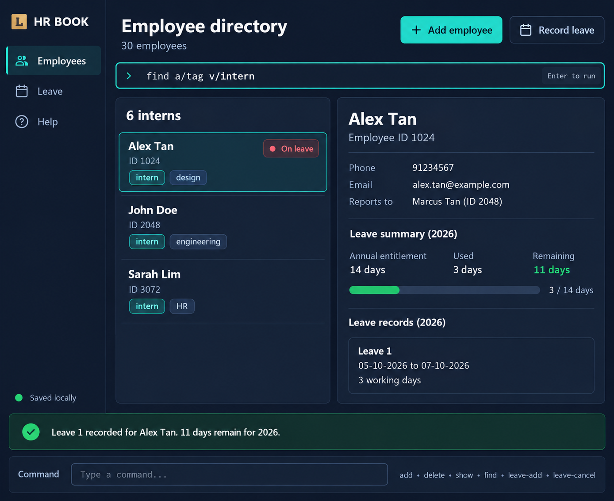

**HR Book** is a desktop application that helps HR Operations Managers at small startups manage employee records and routine administrative work efficiently. It is optimized for fast keyboard-based input through a Command Line Interface (CLI), while its Graphical User Interface (GUI) presents employee and leave information clearly.

HR Book enables an HR manager to:

* add and delete employee records containing contact details, annual leave entitlement, reporting relationships, and tags;
* retrieve specific employee details and find employees by attributes such as name, contact number, email, employee ID, boss ID, leave entitlement, leave date, or tag;
* record and cancel employee leave while validating leave quotas, working days, and overlapping leave periods; and
* continue working across sessions through automatic local saving and loading of employee and leave data.

HR Book is intended for internal employee administration. Recruitment, talent acquisition, and communication between employees are outside the scope of the application.

For detailed information about using and developing HR Book, see the [User Guide](docs/UserGuide.md) and [Developer Guide](docs/DeveloperGuide.md).

## Acknowledgement
This project is based on the AddressBook-Level3 project created by the [SE-EDU initiative](https://se-education.org).
