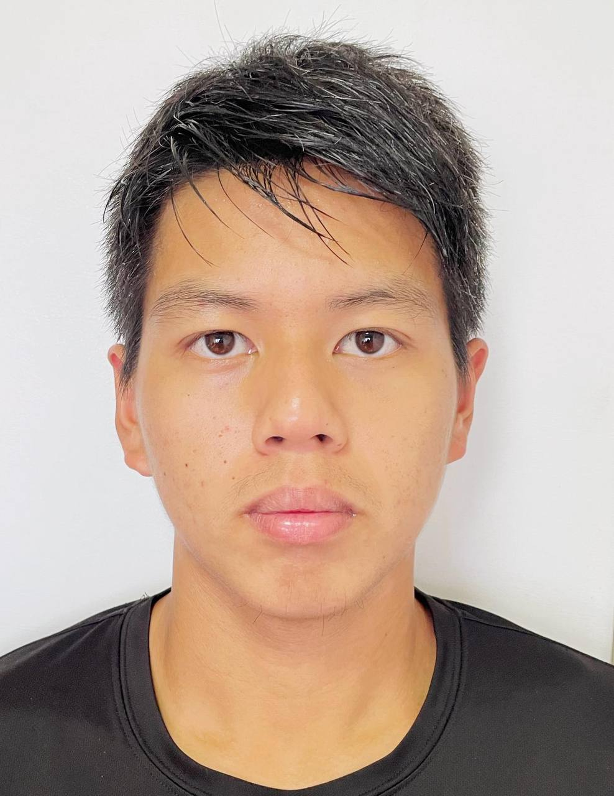
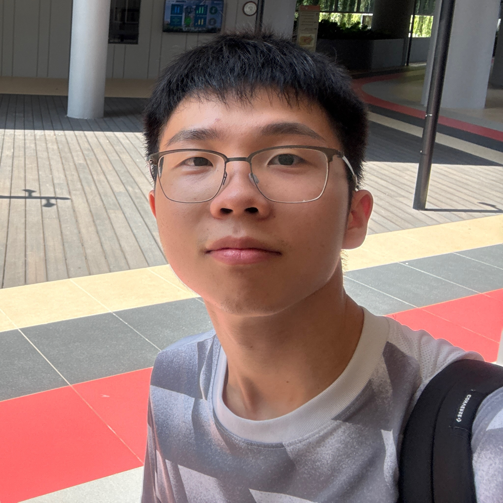
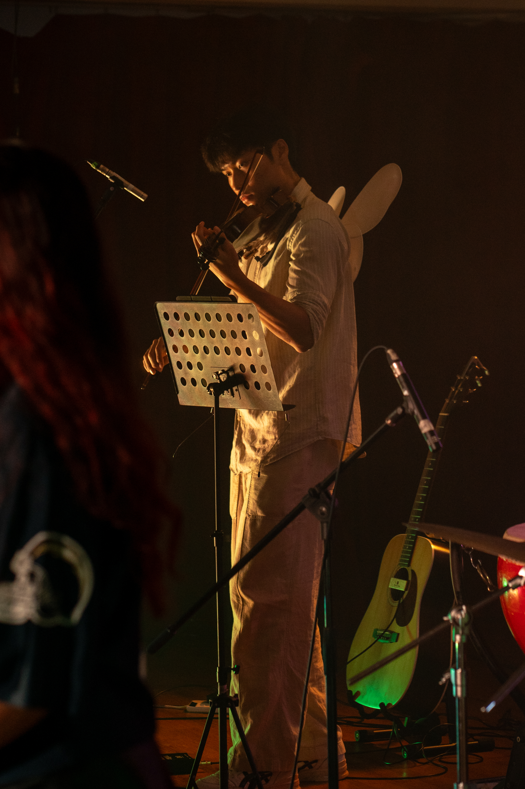
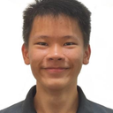

We are a team based in the [School of Computing, National University of Singapore](https://www.comp.nus.edu.sg).

You can reach us at the email `seer[at]comp.nus.edu.sg`

## Project team

### Goh Sze Han Matthew

[[github](https://github.com/MattGoddd)]

* Role: Developer
* Responsibility: Storage

### Lee Zi Rong

[[github](https://github.com/zirong679)]

* Role: Developer

### Kuah Gene Qhee

[[github](https://github.com/geengene)]

* Role: Developer
* Responsibilities: Logic

### Jean Doe

[[github](http://github.com/johndoe)]
[[portfolio](team/johndoe.md)]

* Role: Developer
* Responsibilities: Dev Ops + Threading

### Lee Ren Kai

[[github](http://github.com/USER-LRK)]

* Role: Developer
* Responsibilities: UI
